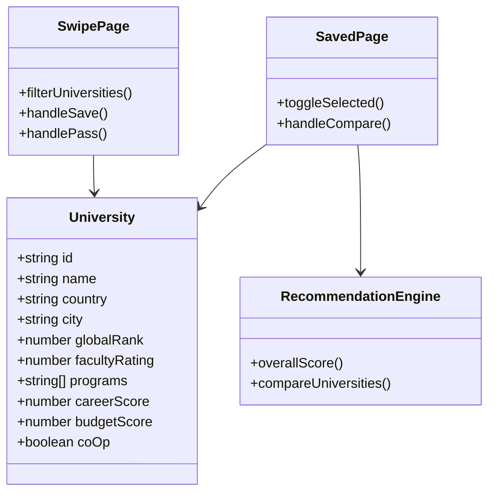
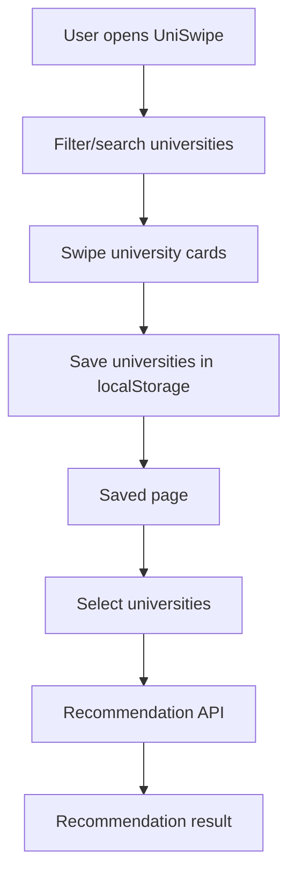

# UniSwipe UML / Architecture

```mermaid
classDiagram
    class University {
      +string id
      +string name
      +string country
      +string city
      +number globalRank
      +number facultyRating
      +string[] programs
      +number careerScore
      +number budgetScore
      +boolean coOp
    }

    class SwipePage {
      +filterUniversities()
      +handleSave()
      +handlePass()
    }

    class SavedPage {
      +toggleSelected()
      +handleCompare()
    }

    class RecommendationEngine {
      +overallScore()
      +compareUniversities()
    }

    SwipePage --> University
    SavedPage --> University
    SavedPage --> RecommendationEngine
```

```mermaid
flowchart TD
    A[User opens UniSwipe] --> B[Filter/search universities]
    B --> C[Swipe university cards]
    C --> D[Save universities in localStorage]
    D --> E[Saved page]
    E --> F[Select universities]
    F --> G[Recommendation API]
    G --> H[Recommendation result]
```
